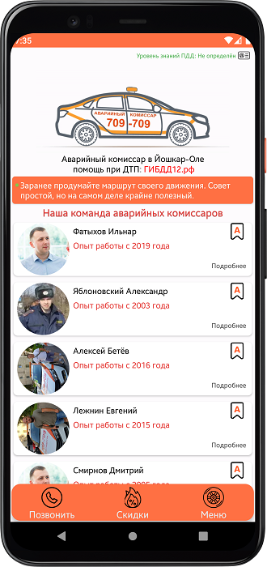

<h1 align="center">АВАРКОМ</h1>

## Описание
Мобильное Android-приложение АВАРКОМ предназначено для облегчения жизни клиентам в затруднительных ситуациях на дороге включая получения актуальных скидок от партнеров для каждодневного использования. Оно позволяет без каких-либо затруднений вызвать себе подмогу в лице профессионального специалиста “аварийного комиссара” при дорожно-транспортном происшествии, который поможет с оформлением ДТП.
## Функционал
### Приложение АВАРКОМ включает в себя следующий функционал:
- **Просмотр** информации о компании АВАРКОМ г. Йошкар-Ола
- **Показ** расположения офиса компании на карте (Яндекс карты)
- **Возможность** позвонить одному из аварийных комиссаров
- **Просмотр** новостей компании (лента Вконтакте)
- **Получение** актуальных скидок от партнеров
- **Игра** на знание ПДД (официальные вопросы ГИБДД)
- **Возможность** проверки полиса ОСАГО и наличия штрафов ГИБДД
## Снимки экрана

Главный экран | О компании | О сотруднике
:---:     |   :---:    |     :---:
 |  | 
___

Скидки | Новости | Игра ПДД
:---:  |  :---:  |  :---:
 |  | 
